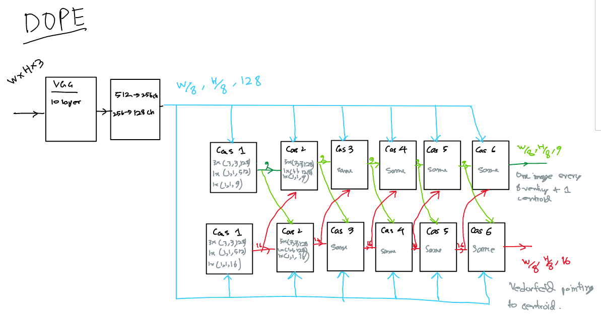

Presentation video link: [youtube](https://youtu.be/wGJTIeSog-k) 
  
## Abstract
In this project, I experiment with the network designing/modification of 
[DOPE](https://github.com/NVlabs/Deep_Object_Pose). DOPE stands for Deep Object Pose 
Estimation. It is a 6 DoF pose estimator built with approximately 92 conv layers. I wanted to learn more about 
designing such elaborate neural networks by trying to play around with the architecture of original DOPE. 
This project is the result of 1 months work, where I have experimented with more than 20 different versions. I could 
not present my findings from each of them so in this file I present a few of them. First, I present 
the effects of transfer learning. Then I introduce DOPE_2, DOPE_2.1, DOPE_2.2 which are modifications of original 
DOPE architectures. Finally, I present a network called ResNetPose, which is a pose estimator like DOPE but built 
on ResNet34 and has residual connections with-in each cascade. For each presented network, I demonstrate an 
estimation of their performance. At the end, I conclude with my observations in the discussion section.

## Installation
Use `pip install -r requirements.txt` to install the requirements.

## Downloads
Trained weights and dataset are uploaded in this [link](https://sooners-my.sharepoint.com/:f:/g/personal/abdul_mukit_ou_edu/Em6yJ_XHDZdAhzZ7L4E9fFABhW61w9zvSG7cuTwfRgUuyA?e=UYN0JY).   
Size of download will be ~15GB in total.    
Place the downloaded "Dataset" and "weights" folder inside "respose" folder.

## Usage:
Project report: Use `Project.ipynb`
Open in a jupyter-notebook or in google-colab to play around with the file.  

Training: Use `train.py`  
Sample command from terminal: 
`python train.py --network "DOPE_2.2" --outf "dope2.2_meat" --data "/home/mukit/Datasets/fat/single/010_potted_meat_can_16k/" --epoch 60 --featureNet "vgg" --lr 0.0001 --gpuids 1`  
More details of training can be found inside the `train.py` file.

## Network Digrams:
Following are simple block diagrams of original DOPE network and my proposed networks.
 
### Original DOPE Network:

### DOPE_2 Network:

### DOPE_2.1 Network:

### ResNetPose full Network:

### ResNetPose Zoomed Cascades Part:

